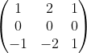
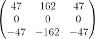
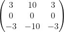
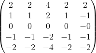
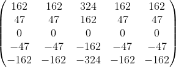
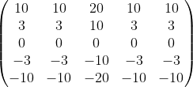

# Edge detection

Herramienta desarrollada para analizar los bordes de una imagen satelital por medio de diferentes kernels dependiendo la resolucion.

Los kernels disponibles son los siguientes:

- Sobel 3
  
- Scharr 3
  
- Feldman 3
  
- Sobel 5
  
- Scharr 5
  
- Feldman 5
  
